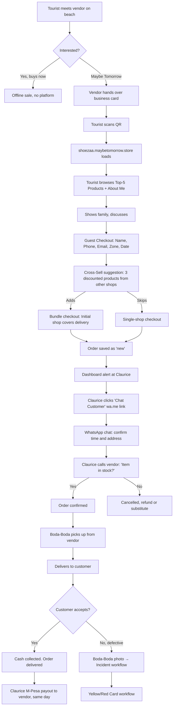
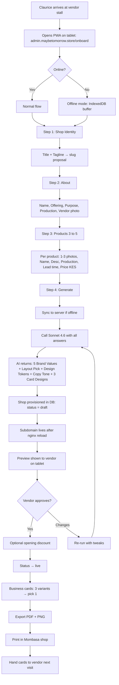
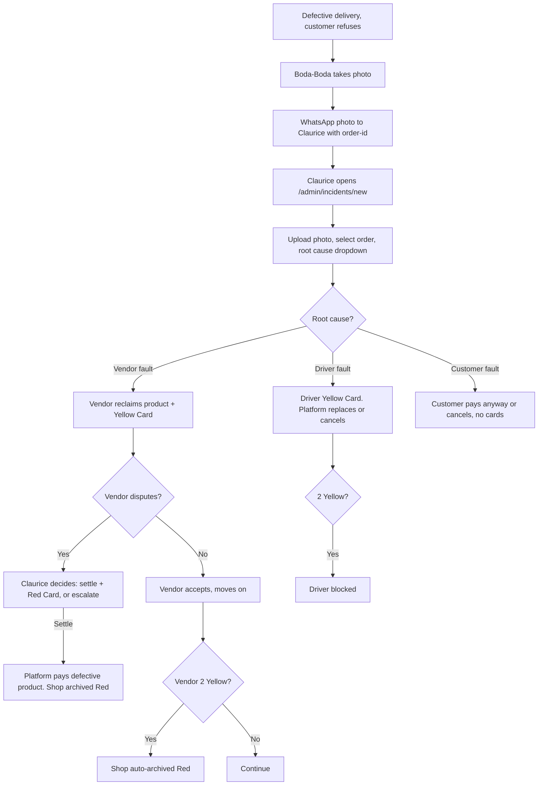

# MaybeTomorrow.store — Beach Vendor E-Commerce Platform for Diani/Kenya

**Concept Type:** Business / Technical Hybrid
**Status:** Draft → In Progress
**Created:** 2026-04-09
**Author:** Frank (Concept) + Claude Opus 4.6 (Architecture)
**Pilot Location:** Diani Beach, South Coast Kenya
**Platform Owner:** Claurice (Kenya Registered Business)
**Tech Partner:** Frank (silent, hosting & build)
**Hosted On:** Mahelya Server (IONOS VPS, 87.106.127.232)
**Domain:** maybetomorrow.store (to register)

---

## 0. Purpose — One-Liner

Transform the "Maybe Tomorrow" moment of beach-vendor tourism into a persistent online sales channel, enriched with cross-shop bundling, Boda-Boda delivery, and AI-generated branded micro-shops per vendor.

A tourist meets a beach vendor in Diani, sees beautiful handmade shoes, is asked if they'd like to buy, and says *"Maybe Tomorrow"*. Today, that moment is a lost lead forever. With MaybeTomorrow.store, the vendor hands over a professionally designed business card with a QR code pointing to **shoezaa.maybetomorrow.store** — the vendor's own branded micro-shop. That evening, the tourist opens the link, shows the family, orders a few pairs, Claurice (platform owner) coordinates delivery via WhatsApp, a Boda-Boda driver picks up from the vendor the next day, delivers cash-on-delivery, and Claurice transfers the vendor's share via M-Pesa the same evening. A cross-sell engine suggests products from other vendors in the network — *"Save on delivery?"* — creating a network effect where every vendor helps every other vendor sell.

---

## 1. Vision

### 1.1 The Friction Today
Beach vendors along Diani Beach earn daily from tourist foot-traffic. Every *"Maybe Tomorrow"* from a tourist is a **lost lead forever** because:

- No business card, no website, no phone number exchanged
- No way to re-engage the tourist later that evening or after they leave Kenya
- Vendors operate purely offline, no cross-referrals between stalls
- Tourists buy spontaneously or not at all — no "sleep on it" option exists
- Cash-only, face-to-face, no persistence

### 1.2 The Opportunity
MaybeTomorrow.store gives each participating vendor a **personal branded mini-shop**, cross-linked with a small network of other vendors, with **cash-on-delivery** via a shared logistics layer (Boda-Boda). The platform:

- Extends the sales moment from "now or never" to "now AND later"
- Turns spontaneous interest into bookable orders after the tourist returns to their hotel
- Creates cross-sell opportunities across vendors
- Adds professional trust via branded business cards with QR codes plus AI-generated shop design
- Preserves vendor authenticity — each shop has a unique visual identity derived from the vendor's story and products
- Makes vendors not only single fighters but a cooperative Verbund

### 1.3 Non-Goals
- This is NOT a mass-market marketplace like Jumia
- NOT a payments or fintech platform
- NOT a global e-commerce replacement for international brands
- NOT a native app — deliberately web-only for lowest friction on tourist devices
- NOT a vendor self-service tool at MVP — Claurice proxies all vendor work in the pilot
- NOT Swahili/French/German localised at MVP — English only

---

## 2. Business Model

### 2.1 Revenue Sources

| Source | Mechanism | Amount |
|---|---|---|
| **Platform Margin** | 10% on product GMV | 10% of every order's product subtotal |
| **Delivery Fee** | Zone-based flat fee paid by customer | 300 / 600 / 1200 KES |
| **Payment Fee (Phase 2)** | Pass-through Stripe/M-Pesa fees | ~2.9% + fixed |
| **Incident Settlements (negative)** | Cost if Claurice covers defective goods under dispute | Case-by-case |

### 2.2 Delivery Zones & Pricing

| Zone | Description | Fee (KES) |
|---|---|---|
| **Diani Strip** | Hotel belt along Diani Beach | 300 |
| **South Coast** | Ukunda to Msambweni | 600 |
| **Mombasa** | Likoni Ferry + Mombasa Island | 1200 |
| **Further (Nairobi, international)** | Not automated — WhatsApp Quote Flow | TBD manually |

### 2.3 Bundle-Delivery Rule (MVP)
When a customer checks out from multiple shops in one order (triggered by Cross-Sell), the **Initial Shop** — the shop whose subdomain/card the customer landed on first — **pays the full delivery fee**. Cross-sold shops receive 100% of their Net (minus 10% platform margin), no delivery deduction.

This creates a **pay-it-forward network effect**: every shop is sometimes Initial, sometimes Cross-Sell beneficiary. Over time, delivery cost burden averages out, and every vendor has a direct incentive to promote every other vendor's products.

### 2.4 Vendor Payout Policy
- **Trigger:** Order status transitions to `delivered`
- **Timing:** Same day, manually confirmed by Claurice in the Admin Dashboard
- **Channel:** M-Pesa Till (Claurice → Vendor's M-Pesa number)
- **Formula:** `payout_kes = (product_subtotal × (1 - discount)) × (1 - 0.10) - incident_deductions`
- Delivery fee is NOT added to vendor payout — it flows to Boda-Boda plus a platform buffer

### 2.5 Boda-Boda Payout
Fixed partnership — daily or weekly settlement between Boda-Boda driver and Claurice. Incident Yellow/Red cards reduce or block driver payouts.

### 2.6 Pricing & Currency
- **Master price:** Always stored in **KES** (`price_kes` column, integer)
- **Display:** Customer sees KES, USD, EUR, CHF simultaneously
- **Exchange rates:** Fetched daily from **exchangerate.host** free-tier at 06:00 UTC → cached in `currency_rates` table
- **Rounding:** `smartRoundUp(value)` rounds up to nearest 0.5 with max one decimal place
  - 4.23 EUR → 4.5 EUR
  - 4.61 EUR → 5.0 EUR
  - 12.07 USD → 12.5 USD

```typescript
export function smartRoundUp(value: number): number {
  return Math.ceil(value * 2) / 2;
}
```

### 2.7 Economic Sanity Check
- 5 vendors × 3 orders/week × avg 2,500 KES = 37,500 KES weekly GMV
- Platform margin × 10% = 3,750 KES/week = ~15,000 KES/month (~110 EUR)
- Covers hosting + Claude API + SSL + domain (~50 EUR) with ~60 EUR profit for Claurice
- **Go/No-Go gate:** ≥50k KES GMV/month and ≥3 active vendors after month 3

---

## 3. Stakeholders

| Stakeholder | Role | Device | Login (MVP) |
|---|---|---|---|
| **Claurice** | Platform Owner, Operator, Admin | Tablet (onboarding PWA) + Laptop (full Admin) + Private WhatsApp | Admin login (phone + password via NextAuth) |
| **Frank** | Silent Tech Partner, Infrastructure | Laptop | DB root access via SSH; no formal UI login |
| **Vendors (3 to 5)** | Shop owners, content sources | Own smartphone later (Phase 2) | None in MVP — Phase 2: phone + WhatsApp Magic Link |
| **Boda-Boda driver** | Delivery partner | Own smartphone (WhatsApp) | None — evidence photos via WhatsApp |
| **Tourist / Customer** | Buyer | Any device, mobile-first | Guest checkout only |

---

## 4. End-to-End Flows

### 4.1 Tourist Flow — The Core



### 4.2 Vendor Onboarding Flow — Claurice on the beach



### 4.3 Incident Flow — Yellow/Red Card



---

## 5. Product Scope — MVP vs Phase 2

### 5.1 MVP (Pilot)

**Included:**
- Domain maybetomorrow.store, wildcard DNS, Let's Encrypt wildcard SSL
- Landing page with Shop Directory (random shuffle per visit)
- 3–5 live shops on subdomains with AI-generated themes (5 layout variants)
- Guest Checkout with KES/USD/EUR/CHF dual display and smart rounding
- Cross-Sell engine post-checkout with 3 suggestions
- Admin Dashboard (Claurice only): shop CRUD, order mgmt, on-behalf vendor editing, incident workflow, payout log, KPI view
- Onboarding PWA (tablet) with offline IndexedDB buffer
- Sonnet 4.6 AI Design Generation (brand values, layout, tokens, card designs)
- Business Card Generator: 3 variants, print-ready PDF + PNG preview, QR embedded
- Cash on Delivery checkout flow
- Same-day manual M-Pesa vendor payout via Dashboard (data log only, no API call)
- WhatsApp Click-to-Chat integration (wa.me links with prefilled text)
- Yellow/Red Card Incident system
- Newsletter opt-in at checkout (data collection stub)
- KPI dashboard — funnel metrics focus (cards → visits → checkouts → delivered)
- International order request → WhatsApp Quote flow (manual via Claurice)

**Explicitly excluded (Phase 2+):**
- Vendor self-service login and dashboard
- Stripe integration (card payments)
- M-Pesa API integration (automated payout)
- Real international shipping with tax calculation
- Product reviews, ratings
- Hotel concierge affiliate program
- Marketing automation, email campaigns
- Mobile native app
- In-app chat

---

## 6. Technical Architecture

### 6.1 Stack

| Layer | Choice | Rationale |
|---|---|---|
| **Framework** | Next.js 16 (App Router) | Unified FE + BE, Server Actions ideal for admin forms, SSR for SEO |
| **Language** | TypeScript strict | Safety for money handling |
| **ORM** | Drizzle | Type-safe, no decorator magic, migration friendly |
| **DB** | PostgreSQL 16 | Shared Docker instance on Mahelya server, own database `maybetomorrow` |
| **Auth** | NextAuth v5 (Auth.js) | Credentials provider for admin, extensible to WhatsApp Magic Link in Phase 2 |
| **PWA** | next-pwa | Offline onboarding on tablet |
| **Photos** | Local FS `/var/mt-store/uploads` + Nginx serving | Cheap, portable, migratable to R2/S3 later |
| **AI** | Anthropic SDK → Sonnet 4.6 | Brand values, layout pick, design tokens, card designs |
| **PDF** | @react-pdf/renderer | Server-side print PDF for business cards |
| **QR** | `qrcode` npm lib | Embed QR in business cards |
| **Currency** | exchangerate.host free | Daily cron 06:00 UTC |
| **i18n** | Single locale: `en` | Pilot constraint |
| **Deployment** | PM2 on Mahelya server port 3003 | Same ops model as existing services |
| **Nginx** | Wildcard vhost `*.maybetomorrow.store` | Multi-tenant subdomain routing |
| **SSL** | Certbot DNS-01 via IONOS DNS API | Wildcard cert required |
| **CI** | GitHub Actions: lint + typecheck + migrate dry-run | Minimal for MVP |

### 6.2 Hosting & Deployment Target: Mahelya (not PHIbel)

- **Server:** IONOS VPS 87.106.127.232, Ubuntu 24.04 LTS, 6 vCores, 8 GB RAM
- **Existing stack:** Node 22, Docker Postgres 16 (port 5432), PM2, Nginx (port 80/443), PM2 apps `backend`(3001) + `dashboard`(3000)
- **MaybeTomorrow reserved port:** **3003**
- **Repo location on Mahelya:** `~/maybetomorrow-store/`
- **Shared Docker Postgres:** use existing container, create new database `maybetomorrow`
- **Separation from Mahelya application code:** sibling deployment, no code or dependency coupling
- **Backup piggyback:** daily `pg_dump maybetomorrow` added to existing Mahelya backup cron

### 6.3 Multi-Tenancy via Subdomain

Next.js `middleware.ts` parses the host header, strips the apex `maybetomorrow.store`, and rewrites:

- apex or `www` → landing page (shop directory)
- `admin` → admin area (protected)
- known shop slug → `/shop/[slug]` rewrite, themed with the shop's layout variant and tokens
- unknown slug → 404 with link back to the directory

### 6.4 Nginx Vhost

```nginx
server {
    listen 443 ssl http2;
    server_name maybetomorrow.store *.maybetomorrow.store;

    ssl_certificate /etc/letsencrypt/live/maybetomorrow.store/fullchain.pem;
    ssl_certificate_key /etc/letsencrypt/live/maybetomorrow.store/privkey.pem;

    client_max_body_size 20M;

    location /_uploads/ {
        alias /var/mt-store/uploads/;
        expires 30d;
        access_log off;
    }

    location / {
        proxy_pass http://127.0.0.1:3003;
        proxy_http_version 1.1;
        proxy_set_header Host $host;
        proxy_set_header X-Real-IP $remote_addr;
        proxy_set_header X-Forwarded-For $proxy_add_x_forwarded_for;
        proxy_set_header X-Forwarded-Proto $scheme;
    }
}

server {
    listen 80;
    server_name maybetomorrow.store *.maybetomorrow.store;
    return 301 https://$host$request_uri;
}
```

### 6.5 SSL — Wildcard via DNS-01

- IONOS exposes a DNS API (since 2024)
- Community certbot plugin `certbot-dns-ionos`; fallback is a manual DNS-01 hook script that calls the IONOS API
- Renewal: `certbot renew` in cron plus `nginx -s reload` post-hook plus daily `certbot renew --dry-run` monitoring

### 6.6 IONOS Domain Setup (Frank's manual steps)

1. Register `maybetomorrow.store` at IONOS
2. DNS records: A `@` → 87.106.127.232 and A `*` → 87.106.127.232
3. Create IONOS DNS API key for Let's Encrypt DNS-01 challenge
4. Optional MX-records later if email is needed

---

## 7. Data Model (Drizzle + PostgreSQL)

### 7.1 Enums

```
role            : admin | vendor
shop_status     : draft | live | paused | archived
layout_variant  : earthy-artisan | vibrant-market | ocean-calm | heritage-story | bold-maker
order_status    : new | confirmed | picked_up | delivered | cancelled | refunded
delivery_zone   : diani-strip | south-coast | mombasa | further
incident_severity : yellow | red
incident_subject  : vendor | driver
root_cause      : vendor_fault | driver_fault | customer_fault | unclear
payment_method  : cash | stripe | mpesa
```

### 7.2 Core Tables

- **users** — admin + future vendors (role, phone, name, email, hashed_password, mpesa_number)
- **shops** — one per vendor (slug unique, title, tagline, vendor_user_id nullable, vendor_phone, vendor_mpesa_number, about_photo_url, about_name, about_offering, about_purpose, about_production, brand_values jsonb, layout_variant, design_tokens jsonb, copy_tone, status, yellow_card_count)
- **products** — max 5 active per shop (shop_id, name, description, production_info, delivery_days, price_kes, photos jsonb, is_top5, discount_pct, sold_count, status)
- **orders** — customer header (order_number MT-YYYYMMDD-xxxx, customer_name, customer_phone, customer_email, delivery_zone, delivery_address, delivery_date, delivery_time_note, delivery_fee_kes, initial_shop_id, products_subtotal_kes, margin_kes, total_kes, payment_method, status, newsletter_optin, notes, confirmed_at, delivered_at)
- **order_items** — line items (order_id, shop_id, product_id, qty, unit_price_kes, discount_pct, line_total_kes, margin_kes, is_cross_sell)
- **currency_rates** — daily cache (date pk, usd, eur, chf, source, fetched_at)
- **incident_cards** — Yellow/Red card system (subject_type, subject_id, order_id, severity, root_cause, evidence_photo_url, description, resolution_notes, settlement_kes, issued_by)
- **drivers** — Boda-Boda partners (name, phone, mpesa_number, yellow_card_count, status)
- **cross_sell_impressions** — tracking (trigger_order_id, suggested_product_id, clicked, converted)
- **payouts** — vendor settlement log (shop_id, order_id, gross_kes, margin_kes, deductions_kes, net_kes, mpesa_ref, paid_at)
- **newsletter_optins** — email, phone, source_shop_id, source_order_id
- **ai_generations** — audit trail (shop_id, purpose, model, prompt_tokens, completion_tokens, cost_usd, response_json)
- **audit_log** — admin actions (user_id, action, entity_type, entity_id, meta)
- **card_scans** — QR visit attribution (shop_id, card_variant, session_id, user_agent, referer)

Complete schema definitions are in `src/lib/db/schema.ts` of the `maybetomorrow-store` repo.

---

## 8. AI Design Generation — Sonnet 4.6

### 8.1 Prompt summary

The Sonnet system prompt frames the model as a brand strategist and visual designer for a Kenyan beach-vendor. Given the vendor's about answers and 3–5 products, the model produces strict JSON matching a TypeScript DesignResponse shape with:

- 5 brand values (short phrases, specific, authentic)
- One of five pre-built layout variants
- Design tokens (colors, fonts, radius, hero treatment)
- Copy tone sentence
- Optionally refined About text
- Three business card variants with layout specs

### 8.2 Five pre-built layout variants

All five are Next.js React components implementing the same Props contract (`ShopLayoutProps`). They differ in spacing density, photo treatment, typography hierarchy, section order, and micro-interactions:

1. **earthy-artisan** — warm earth tones, story-first, handcrafted feel
2. **vibrant-market** — bright colors, dense grid, market energy
3. **ocean-calm** — blue tones, polaroid photos, calm pace
4. **heritage-story** — cream and deep accent, full-width photos, legacy feel
5. **bold-maker** — brutalist, large type, unapologetic

### 8.3 Business Card Generator

- Three variants: `photo-hero`, `minimal-typo`, `pattern-bold`
- Generation via @react-pdf/renderer (print PDF, CMYK profile, 3mm bleed, 85×55mm EU format)
- PNG preview via puppeteer or canvas
- QR code embedded via `qrcode` npm lib, pointing to `{slug}.maybetomorrow.store`

### 8.4 Fallback
If Sonnet call fails, default to `earthy-artisan` layout with warm ochre tokens. Regeneration is available anytime from the admin panel.

### 8.5 Cost Budget
Sonnet 4.6 at ~15k input and ~3k output tokens per generation ≈ $0.08 per shop. Pilot total: ~$1.20 across 5 shops with retries — negligible.

---

## 9. Cross-Sell Engine

### 9.1 Trigger Points
- Checkout confirmation page
- WhatsApp template message (copy-paste from admin dashboard)
- (Phase 2) post-order follow-up email

### 9.2 Selection Algorithm (MVP)
1. Fetch all `is_top5 = true` products from OTHER shops
2. Rank by price proximity (±50% of average line price), discount availability, low recent exposure
3. Return 3 results, deterministic per order (seeded by order-id)

Phase 2 upgrade: embedding-based similarity.

### 9.3 Display

```
Your order is placed!

Save on delivery by adding these from other shops
— same Boda-Boda delivery, no extra fee:

[Product A]    [Product B]    [Product C]
 KES 1,200      KES 800         KES 2,400
 -10%           -15%            —
```

### 9.4 Attribution
`cross_sell_impressions` logs render/click/conversion for KPI funnel.

---

## 10. Admin Dashboard — Claurice's Control Center

### 10.1 Navigation

- Dashboard (KPI cards + today's orders + alerts)
- Shops (list, create, edit, archive, view incidents)
  - Onboarding PWA (tablet-optimized)
- Products (per-shop CRUD, Top-5 toggle, discounts)
- Orders (funnel view: new → confirmed → picked_up → delivered)
  - Order Detail (Chat Customer wa.me, Call Vendor, Mark Delivered, Incident)
- Payouts (pending vendor payouts → M-Pesa confirmation entry)
- Drivers (Boda-Boda partner list + cards)
- Incidents (Yellow/Red card log with evidence photos)
- KPI (funnel attribution dashboard)
- Currency Rates (latest + cron status + manual refetch)
- Settings (API keys, WhatsApp template text, zone prices)

### 10.2 KPI Dashboard — funnel focus

Primary widgets:
- Card distribution counter (manual entry per vendor visit)
- Subdomain visits → sessions (per shop) from `card_scans`
- Conversion funnel Visits → Cart → Checkout → Delivered
- GMV last 30 days (secondary metric)
- Active vendors (delivered orders in last 14 days)
- Cross-Sell CTR
- Yellow/Red card rate

### 10.3 3-month Go/No-Go gate
- ≥3 active vendors (each ≥3 delivered orders in last month)
- ≥50k KES GMV/month
- Cross-Sell CTR ≥10%
- Incident rate <5%

---

## 11. Vendor Onboarding PWA (Tablet)

- Route: `/admin/onboard`
- Device: Claurice's 10-inch Android tablet (Samsung Tab A9+ class, ~150 EUR)
- PWA with next-pwa, service worker, add-to-home-screen
- Offline: IndexedDB buffer for step answers plus photo blobs; sync on reconnect
- Photo capture via `<input type="file" accept="image/*" capture="environment">`
- Auto-save every step to IndexedDB immediately
- Draft recovery on tablet crash
- Generate button triggers Sonnet call, progress bar ~15s, preview, vendor approval, `status → live`

---

## 12. Rollout Plan

| Phase | Week | Deliverables | Gate |
|---|---|---|---|
| **P0 Foundation** | 1 | Repo, Next.js 16, Drizzle schema, IONOS domain + DNS + SSL, Nginx vhost, middleware, landing scaffold | `hello.maybetomorrow.store` renders |
| **P1 Admin Core** | 2 | NextAuth admin login, Shop/Product/Order CRUD, migrations, audit log | Claurice can manually create a shop |
| **P2 AI Generation + Themes** | 3 | 5 layout variants, Sonnet integration, brand-values prompt, business-card PDF/PNG + QR | JSON input → rendered themed shop |
| **P3 Tourist Flow** | 4 | Guest checkout, currency cron + smart-round, cross-sell engine, WhatsApp click-to-chat, order status transitions, card-scan tracking | End-to-end test order delivered |
| **P4 Incidents + Payouts + KPI** | 5 | Incident workflow, Yellow/Red automation, payout log, KPI dashboard, settings | Full feature-complete MVP |
| **P5 Pilot Launch** | 6 | Claurice onboards 3 real vendors, prints cards, distributes at Diani | First real "Maybe Tomorrow" → delivered |
| **P6 Pilot Run** | Months 2–3 | Scale to 5 vendors, weekly KPI review, feedback loop | Go/No-Go gate hit or missed |

---

## 13. Risks & Mitigations

| Risk | Impact | Mitigation |
|---|---|---|
| Low tourist conversion | Critical | Heavy focus on card distribution attribution, iterate card design |
| Vendor no-show on pickup | High | Claurice calls to confirm before Boda-Boda dispatched |
| Customer rejects at door | Medium | Soft-launch policy, platform covers delivery loss, track as KPI |
| Boda-Boda cash skimming | Medium | Daily cash reconciliation, photo pipeline, Yellow/Red cards |
| CITES wood artifacts | Medium | Claurice manually filters Int'l quote requests |
| Sonnet API failure during onboarding | Low | Deterministic fallback layout, regenerate anytime |
| Wildcard SSL renewal failure | High | Daily renew dry-run cron + email alert |
| Domain dispute or trademark | Low | `maybetomorrow.store` appears free; check USPTO/WIPO |
| Data loss | High | Daily pg_dump to Mahelya backup path, piggybacks existing backup cron |
| AI budget misuse | Low | `ai_generations` cost tracking, alert if spend >$20/month |
| Claurice burnout | Medium | Phase-2 priority is vendor self-service, limit to 5 shops until then |

---

## 14. Legal & Org Structure

- **Platform legal owner:** Claurice's registered Kenya business
- **Tax handling:** Claurice's existing bookkeeping; 10% margin + delivery fee as business revenue
- **Customer-facing contract:** Standard English terms, points to Claurice's entity; cash-on-delivery refund and defect policies
- **Vendor agreement:** Simple 1-page paper contract at onboarding; 10% margin, Yellow/Red card system, same-day payout policy
- **Driver agreement:** Analogous for Boda-Boda partners
- **Data protection:** Kenya Data Protection Act 2019 compliant; minimal customer data (name, phone, address), deleted after 2 years unless dispute
- **Tech partnership:** Private MoU between Frank and Claurice; hosting and tech from Frank, operations and revenue from Claurice; optional margin split side-agreement; IP ownership with Frank until formal joint-entity is decided

---

## 15. Open Questions & Next Actions

### Open (need Claurice input before pilot-launch)
- Confirm 3 initial vendors (identity, products)
- Confirm Boda-Boda partner identity
- Confirm Mombasa print shop for business cards
- Confirm exact delivery zone fee values
- Claurice's M-Pesa Till number

### Next Actions (Frank)
- Register `maybetomorrow.store` at IONOS
- Configure DNS A-records (apex + wildcard) pointing to `87.106.127.232`
- Create IONOS DNS API key for Let's Encrypt
- Send API credentials to tech partner for `/etc/letsencrypt/ionos.ini` setup
- Verify wildcard cert issuance

---

## 16. Connection to Existing Concepts

- **#100 Kenya Connector** — complementary; LinkedIn trust network for Kleeblatt partners, MaybeTomorrow is a concrete business running through that trust layer
- **#101 REE with Dignity / Mrima Hill** — conceptual kinship (Afrika-Leuchtturm, fair value chains), no tech coupling
- **PHIbel Architect Coach** — concept lives here as myConcept, updates via normal concept lifecycle

---

## 17. Appendix — Sample Sonnet Input and Output

### 17.1 Input (from vendor interview)

```json
{
  "shop_title_draft": "Shoezaa",
  "tagline_draft": "Shoes for the zaa feeling",
  "about": {
    "name": "John Mwangi",
    "offering": "Handmade leather sandals and kofia slippers",
    "purpose": "I want every foot that walks Diani to feel the ocean",
    "production": "We cut leather from local tanneries in Mombasa, stitch by hand in my brother workshop, soles from recycled tire rubber"
  },
  "products": [
    { "name": "Zaa Sandals", "description": "Barefoot feel leather sandals with tire sole", "price_kes": 2500 },
    { "name": "Kofia Slipper", "description": "Indoor slipper with traditional kofia pattern", "price_kes": 1800 },
    { "name": "Ocean Walker", "description": "Trekking sandal with ankle strap", "price_kes": 3200 },
    { "name": "Kid Zaa", "description": "Kid-size Zaa Sandals", "price_kes": 1200 }
  ]
}
```

### 17.2 Expected Output

```json
{
  "brand_values": ["Handcrafted", "Coastal", "Grounded", "Reclaimed", "Personal"],
  "layout_variant": "earthy-artisan",
  "design_tokens": {
    "primary": "#B6702D",
    "secondary": "#2F4238",
    "accent": "#E8D5A4",
    "font_display": "Fraunces",
    "font_body": "Inter",
    "radius": "lg",
    "hero_treatment": "warm-overlay"
  },
  "copy_tone": "warm, grounded, story-first, proud of craft",
  "about_refined": "I am John. For every foot walking Diani, I stitch leather sandals by hand with my brother — soles from recycled tires, feel from the ocean.",
  "business_cards": [
    { "variant": "photo-hero", "tagline": "Shoes for the zaa feeling" },
    { "variant": "minimal-typo", "tagline": "Handcrafted on Diani" },
    { "variant": "pattern-bold", "tagline": "Zaa. Since always." }
  ]
}
```

---

## 18. Glossary

- **Boda-Boda** — motorbike taxi common in East Africa; doubles as small-parcel courier
- **KES** — Kenyan Shilling, master currency for all prices
- **M-Pesa** — dominant mobile-money platform in Kenya (Safaricom)
- **Diani** — beach town 30 km south of Mombasa, Indian Ocean coast
- **Cross-Sell Piggyback** — MaybeTomorrow rule where initial-shop carries delivery, cross-sell shops do not; pay-it-forward network effect
- **Yellow/Red Card** — disciplinary system for vendors and drivers, borrowed from football
- **Zaa** — Swahili-rooted word used here as vendor-shop identity example

---

**End of Concept — MaybeTomorrow.store**
**Version 1.0 — In Progress**
**Last updated: 2026-04-09**
